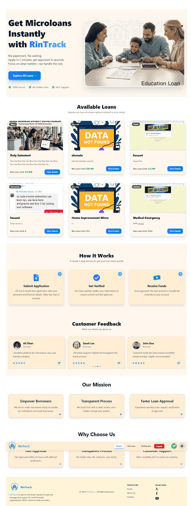
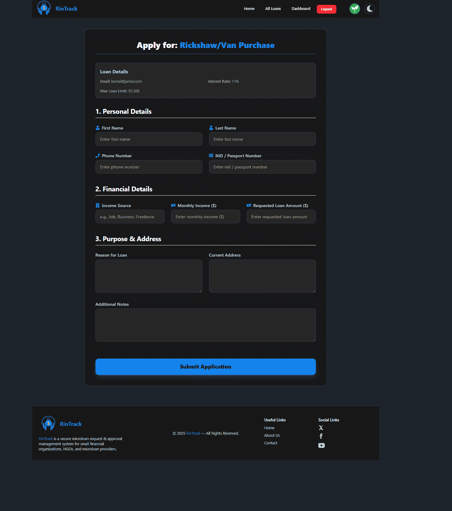
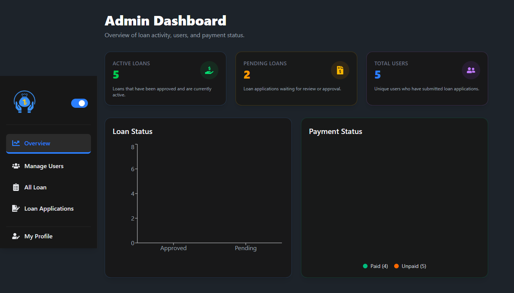
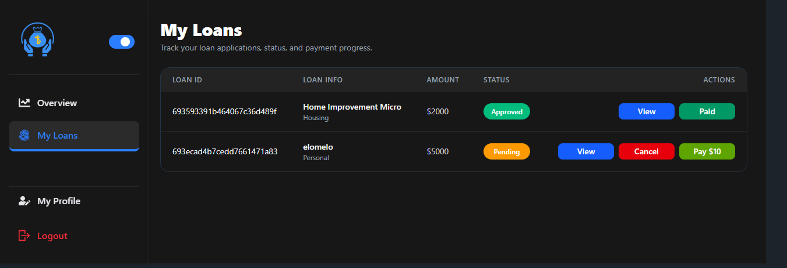

# RinTrack  - Microloan Request & Approval Tracker System


**RinTrack** is a full-stack, web-based microloan request, review, and approval management system designed for **borrowers, managers, and administrators**.

It enables users to easily **explore available loans and submit loan requests**, while ensuring **secure and seamless payment handling**.
At the same time, **administrators and managers**—including small financial organizations, NGOs, and microloan providers—can efficiently **manage users, loan applications, approvals, EMI schedules, and repayments** through a **powerful role-based dashboard**.

RinTrack simplifies the entire microloan lifecycle by providing a **fast, paperless, and transparent digital solution** for all stakeholders.

---

### 📸 Screenshots

<table><tr>
<td align="center"> <strong>🏠 Landing Page</strong><br/> <a href="./public/landing_page.png">  </a></td>
<td align="center"> <strong>👤 Borrower – Loan Request</strong><br/> <a href="./public/loan_request.png">  </a> </td>
<td align="center"> <strong>📊 Admin Dashboard</strong><br/> <a href="./public/admin_dashboard.png">  </a> </td>
<td align="center"> <strong>✅ Loan Approval Flow</strong><br/> <a href="./public/loan_approval.png">  </a> </td> 
</tr> </table>

---

## 🔐 Admin Credentials

**Email:** `admin@rintrack.com` <br/>
**Password:** Admin123#

## 🔐 Manager Credentials

**Email:** `manager@rintrack.com` <br/>
**Password:** Manager123#

---

## 🔗 Links:

 🌐 **Live Site:** [RinTrack - Microloan Tracker System](https://rintrack-client.netlify.app) <br/>
 📄 **Server Repo:** [RinTrack Microloan Server](https://github.com/hasan8651/RinTrack-Microloan-Server.git)

---

## 🚀 Features

### ✨ General Features

- Modern landing page with smooth animations.
- Secure authentication and authorization
- Display of available loans dynamically from MongoDB.
- Loan Details page with apply option.
- JWT-based secure API access with httpOnly cookies
- Separate dashboards for borrowers, managers, and administrators
- Responsive UI for mobile, tablet, and desktop.
- Theme toggling (Dark/Light mode).

### 👤 Borrower Features

- Browse and explore available microloan options
- Submit loan requests digitally
- Track loan status and approval progress
- Pay application fees securely via Stripe
- View and manage applied applications
- Update profile and logout

### 🧑 Manager Features

- Add, manage, and update loans.
- Review and verify loan applications
- Update loan applications status (Approved, Rejected)
- Manage borrower information
- Monitor active loans and EMI schedules

### 🛠️ Admin Features

- Search and filter users, loans, applications
- Update and delete existing loans
- Manage all users (update roles, suspend accounts with reason)
- Approve or reject loan applications
- Control which loans appear on Home page.
- Full system overview with tables and stats.

### 🧩 Additional Features

- Loading spinners during API calls.
- Restricted access based on user roles
- Toast notifications for all CRUD actions.
- 404 page for invalid routes.
- Pagination for large datasets.

---

## 🏗️ Technologies Used

### 🎨 Frontend
- React
- React Router
- TanStack Query (React Query)
- Axios
- Framer Motion
- Tailwind CSS
- Recharts
- React Icons
- Sweet Alert

### 🛠️ Backend
- Node.js
- Express.js
- MongoDB
- JWT ( Firebase Authentication using JWT tokens )
- Stripe API

### 🗃️ Authentication & Hosting
- Firebase Authentication
- Vercel (Backend)
- Netlify (Frontend)
- MongoDB Atlas
- ImgBB (Image Hosting)

---

## 📦 Dependencies
```json
  "dependencies": {
    "@headlessui/react": "^2.2.9",
    "@tailwindcss/vite": "^4.1.17",
    "@tanstack/react-query": "^5.90.12",
    "axios": "^1.13.2",
    "daisyui": "^5.5.8",
    "firebase": "^12.6.0",
    "framer-motion": "^12.23.25",
    "react": "^19.2.0",
    "react-dom": "^19.2.0",
    "react-helmet-async": "^2.0.5",
    "react-hook-form": "^7.68.0",
    "react-icons": "^5.5.0",
    "react-router": "^7.10.1",
    "recharts": "^3.5.1",
    "sweetalert2": "^11.26.3",
    "swiper": "^12.0.3",
    "tailwindcss": "^4.1.17"
  },
  "devDependencies": {
   "@eslint/js": "^9.39.1",
    "@types/react": "^19.2.5",
    "@types/react-dom": "^19.2.3",
    "@vitejs/plugin-react": "^5.1.1",
    "eslint": "^9.39.1",
    "eslint-plugin-react-hooks": "^7.0.1",
    "eslint-plugin-react-refresh": "^0.4.24",
    "globals": "^16.5.0",
    "vite": "^7.2.4"
  }
```

---

## 📄 How to Run Locally

### 💻 Client
1. Clone the repository
2. Install dependencies
   npm install
3. Create a .env file with required variables
4. Run the client
   npm run dev

### 🖥️ Server
1. Clone the repository
2. Install dependencies
   npm install
3. Add .env file with required variables
4. Run the server
   nodemon index.js or node index.js

## 🧩 Project Overview
RinTrack provides a paperless, transparent, and efficient digital solution for small financial organizations, NGOs, and microloan providers.
The platform centralizes loan operations and reduces manual overhead through automation and real-time tracking.
- Client: React-based frontend with role-based dashboards
- Server: Express API with JWT-protected routes
- Database: MongoDB collections for users, loans and applications